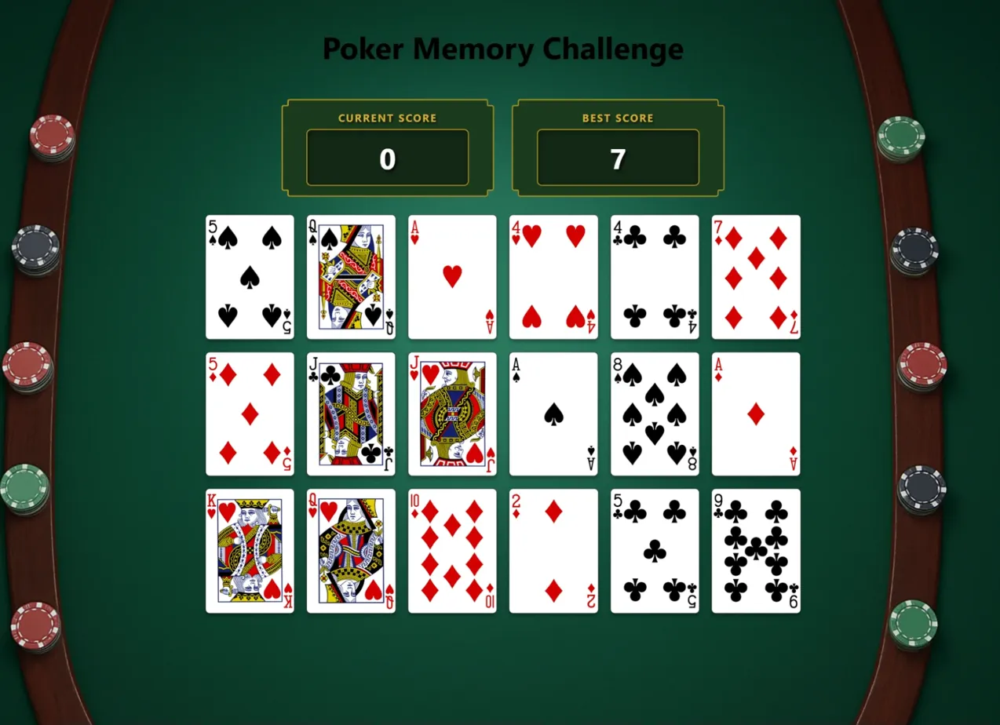

# 🎴 Poker Memory Challenge

A modern, responsive memory card game built with React that challenges players to click through all 52 cards in a deck without repeating any card. Features smooth animations, confetti celebrations, and persistent high scores.

## 🎮 [Play Live Demo](https://memory-card-game-4uo.pages.dev/)


*The game in action - featuring a poker table aesthetic with card grid and score tracking*

## ✨ Features

- **Full Deck Challenge**: Progress through all 52 unique cards in a standard deck
- **Round System**: Cards are presented in sets of 18, shuffling between rounds
- **Score Tracking**: Current score and best score with localStorage persistence
- **Smooth Animations**: Card flip animations and shuffle effects
- **Celebration Effects**: Confetti animation when achieving a new high score
- **Responsive Design**: Fully responsive grid layout that adapts from mobile to desktop
- **Poker Table Aesthetic**: Custom-styled scoreboard with gold and green theme

## 🎮 How to Play

1. Click on any card to select it
2. After each click, cards flip over and shuffle to new positions
3. Try to click all 18 cards in a round without clicking the same card twice
4. Complete multiple rounds to find all 52 unique cards in the deck
5. If you click a card you've already selected, the game ends
6. Beat your high score and trigger a confetti celebration!

## 🛠️ Technologies Used

- **React 19** - UI framework
- **Vite** - Build tool and dev server
- **Canvas Confetti** - Celebration animations
- **Deck of Cards API** - Playing card data and images
- **CSS3** - Custom styling with responsive design
- **localStorage API** - Persistent high score storage

## 📦 Installation

### Prerequisites
- Node.js (v20.19.0 or >=22.12.0)
- npm (v8.0.0 or higher)

### Setup
```bash
# Clone the repository
git clone https://github.com/Abdirazakf/memory-card-game
cd memory-card-game

# Install dependencies
npm install

# Start development server
npm start

# Build for production
npm run build

# Preview production build
npm run preview
```

## 🎯 Game Rules

1. **Objective**: Click all 52 cards in the deck without repeating any card
2. **Rounds**: Cards are presented in groups of 18
3. **Game Over**: Clicking a previously selected card ends the game
4. **Victory**: Successfully clicking all 52 unique cards
5. **Scoring**: Your score increases by 1 for each unique card clicked

## 📁 Project Structure

```
memory-card-game/
├── src/
│   ├── assets/
│   │   ├── background.png
│   │   └── back-of-card.png
│   ├── components/
│   │   ├── App.jsx          # Main app component
│   │   ├── Game.jsx          # Game logic and card grid
│   │   ├── Scoreboard.jsx    # Score display
│   │   └── confetti.js       # Confetti animation
│   ├── styles/
│   │   ├── App.css           # Header styles
│   │   ├── Game.css          # Game grid and card styles
│   │   ├── Scoreboard.css    # Scoreboard styles
│   │   ├── index.css         # Global styles
│   │   └── reset.css         # CSS reset
│   └── main.jsx              # Entry point
├── index.html
├── package.json
└── vite.config.js
```

## 🔌 API Reference

This project uses the [Deck of Cards API](https://deckofcardsapi.com/):

- **Create Deck**: `GET /api/deck/new/shuffle/?deck_count=1`
- **Draw Cards**: `GET /api/deck/{deck_id}/draw/?count=18`

## 🎨 Styling

The game features:
- **Poker table aesthetic** with green felt background
- **Gold-trimmed scoreboard** with custom clip-path
- **Responsive grid layout** that adapts to screen size:
  - Desktop: 6 columns
  - Tablet: 4 columns
  - Mobile: 3-2 columns
- **Smooth card animations** with flip effects
- **Hover effects** for better UX

## 🚀 Development

### Available Scripts

```bash
npm start      # Start development server
npm run build  # Build for production
npm run lint   # Run ESLint
npm run preview # Preview production build
```

### Key Features Implementation

**State Management**
- `deckID`: Stores the current deck identifier
- `cards`: Current set of 18 cards displayed
- `seenCards`: Tracks clicked cards in current round
- `totalCardsFound`: Total unique cards found across all rounds
- `currentScore` & `bestScore`: Score tracking

**Game Flow**
1. Initialize deck on mount
2. Draw 18 cards
3. Player clicks card → Flip & shuffle
4. Check if round complete (18 cards)
5. Load next round or declare victory (52 cards)

## 📝 Notes

- Best scores persist across browser sessions using localStorage
- Cards shuffle after each successful click for increased difficulty
- The game uses the same deck throughout to track all 52 unique cards
- Confetti only triggers when achieving a new personal best

## 🤝 Contributing

Feel free to submit issues and enhancement requests!

## 📄 License

This project is open source and available under the MIT License.

---

**Enjoy the game! 🎰**